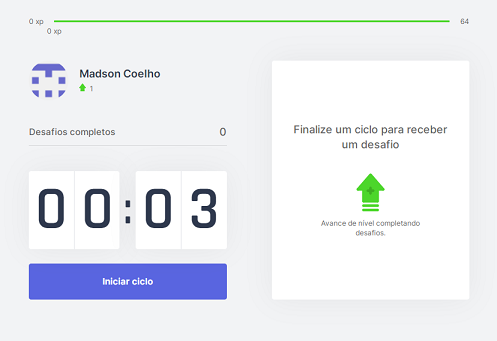
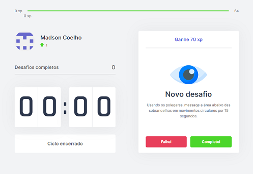
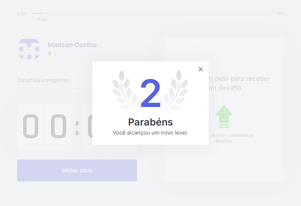

# Moveit
Projeto desenvolvido durante a quarta edição da "Next Level Week" da [RocketSeat](https://rocketseat.com.br/).

Este é um projeto [Next.js](https://nextjs.org/) inicializado com [`create-next-app`](https://github.com/vercel/next.js/tree/canary/packages/create-next-app).

O Moveit é um aplicativo gamificado que permite a definição de um cronômetro decrescente para alertar o usuário de que o mesmo precisa parar o que está fazendo para se alongar. O aplicativo apresenta sugestões de alongamentos e para cada exercício finalizado, a pontuação do usuário aumenta, podendo subir de nível.

## Instruções
Depois de obter o projeto no seu computador, abra uma janela de linha de comandos do sistema e acesse o diretório raíz do projeto.

Instale as dependências:
```bash
yarn
```

Em seguida, inicie o servidor de desenvolvimento:
```bash
yarn dev
```
Abra [http://localhost:3000](http://localhost:3000) com o seu navegador da Web para ver o resultado.

## Principais bibliotecas e dependências de projeto
- ReactJS
- Next.js
- TypeScript
- JSCookie

## Screenshots





